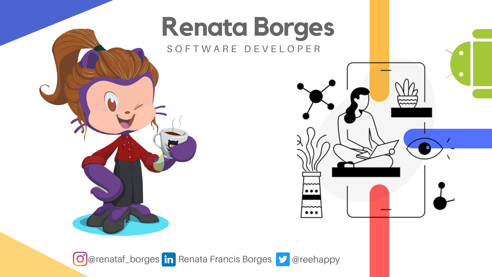

## Olá! Sou a Renata Borges 👋

**Estudante de Análise e Desenvolvimento de  Sistemas, mergulhando de cabeça no Desenvolvimento Mobile com Kotlin, apaixonada pelo universo da tecnologia.**  

<a href="https://www.linkedin.com/in/renata-francis-borges-b6b056158"></img></a> [LinkedIn](https://www.linkedin.com/in/renata-francis-borges-b6b056158)   

* :computer:  Hoje trabalho como Suporte de Integrações no DB1 Group.
* 🙏  Participo da organização da Comunidade [DevGirlsMaringá](https://www.instagram.com/devgirlsmaringa/), adoro compartilhar conhecimento!
* 😀  Sou estudante de Análise e Desenvolvimento de Sistemas. 
* :rocket: Me aventurando em C, Java e Kotlin.
* :coffee: Eu amo café!
* :airplane: Adoro viajar.
* :cat::dog:Apaixonada por animais.

